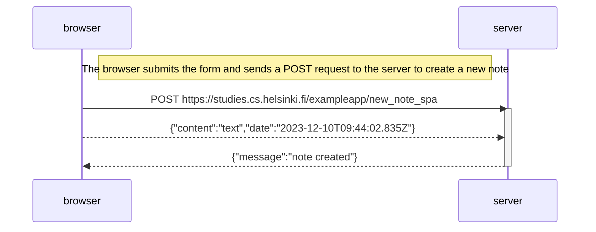

```mermaid
sequenceDiagram
    participant browser
    participant server

   Note right of browser: The browser submits the form and sends a POST request to the server to create a new note
   
    browser->>server: POST https://studies.cs.helsinki.fi/exampleapp/new_note_spa
    activate server
    browser-->>server: {"content":"text","date":"2023-12-10T09:44:02.835Z"}
    server-->>browser: {"message":"note created"}
    deactivate server
```